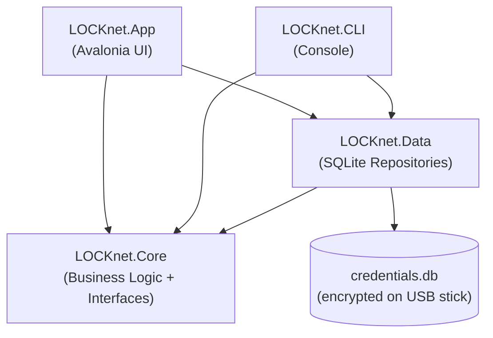
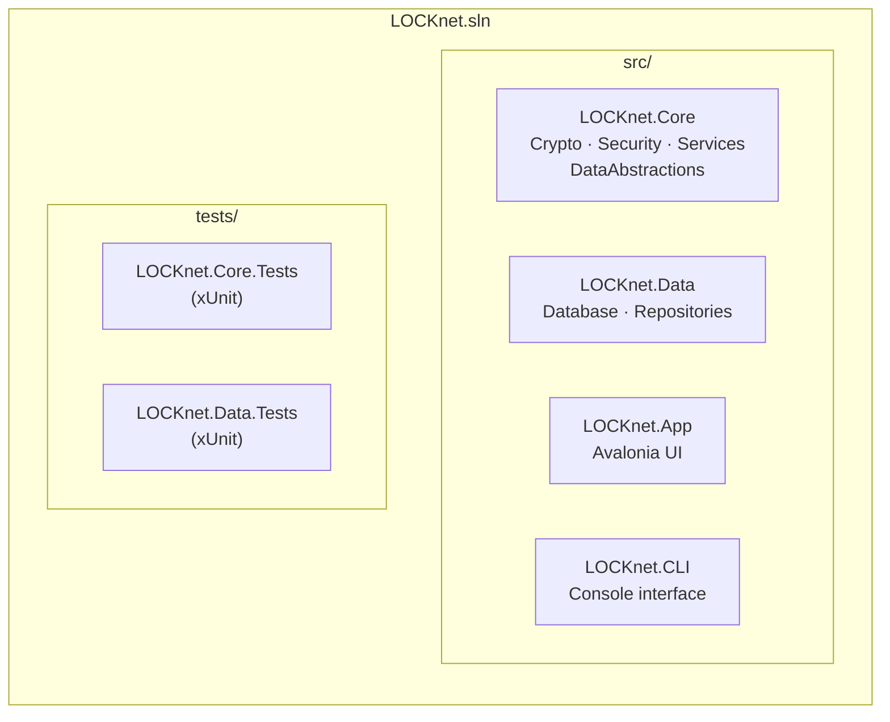
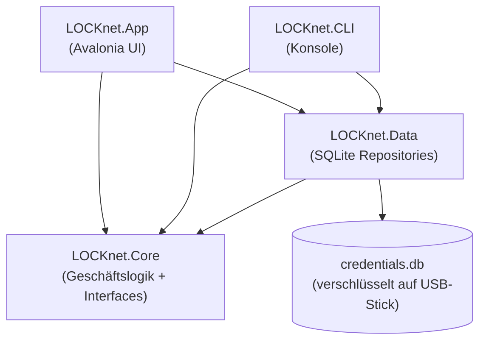
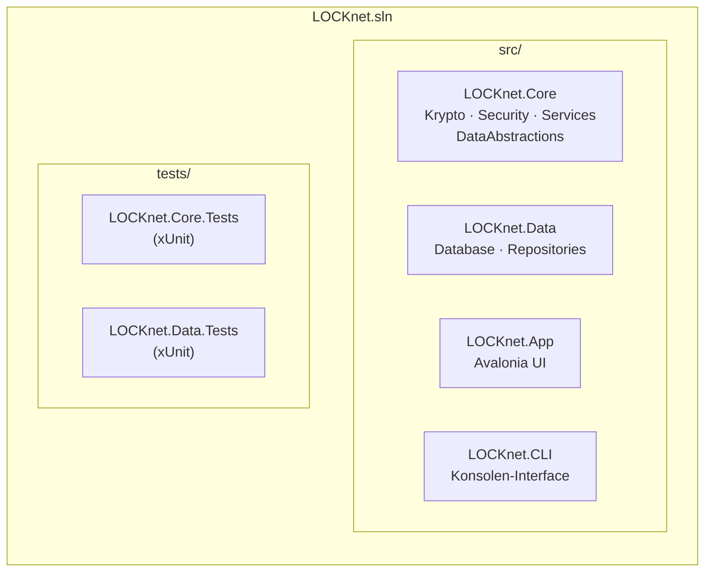

<!-- Language switch -->
**[🇬🇧 English](#english)** | **[🇩🇪 Deutsch](#deutsch)**

---

<a name="english"></a>

# LOCKnet — Local Offline Credential Keeper

[](https://github.com/alhasan-ramadan/LOCKnet/actions/workflows/ci.yml)
[](https://github.com/alhasan-ramadan/LOCKnet/actions/workflows/release.yml)
[](https://alhasan-ramadan.github.io/LOCKnet/coverage/)
[](https://alhasan-ramadan.github.io/LOCKnet/doxygen/)
[](LICENSE)
[](https://dotnet.microsoft.com/en-us/download/dotnet/9.0)

**LOCKnet** is a fully offline password manager built on **.NET 9**, designed to run directly from a **USB stick**. No cloud, no installation, no external dependencies — just plug in and go.

---

## Table of Contents (EN)

- [Features](#features-en)
- [Architecture](#architecture-en)
- [Project Structure](#project-structure-en)
- [Security Design](#security-en)
- [Setup & Build](#setup-en)
- [Running the App](#running-en)
- [Testing & Coverage](#testing-en)
- [Versioning & Release](#versioning-en)
- [Links](#links-en)

---

<a name="features-en"></a>
## Features

- **100% offline** — no internet connection required, ever
- **AES-256-GCM** encryption for all stored passwords
- **PBKDF2** key derivation from your master password (600 000 iterations, OWASP 2023)
- **Auto-lock** after 60 seconds of inactivity
- **SecureString** — no plaintext passwords in RAM
- **Portable** — runs from USB stick on any Windows / Linux / macOS machine
- **Cross-platform UI** via Avalonia
- Optional **CLI** interface for scripting / maintenance

---

<a name="architecture-en"></a>
## Architecture



> **Dependency rule:** `Core` has no dependencies. `Data` depends only on `Core`. `App` and `CLI` depend on both — never the other way around.

---

<a name="project-structure-en"></a>
## Project Structure



```
LOCKnet.sln
├── src/
│   ├── LOCKnet.Core/
│   │   ├── Crypto/                 — AES-256-GCM, PBKDF2, SecureString
│   │   ├── Security/               — SessionManager, MasterKeyManager, ActivityMonitor
│   │   ├── Services/               — CredentialService
│   │   └── DataAbstractions/       — Repository interfaces + domain records
│   ├── LOCKnet.Data/
│   │   ├── Database.cs             — Schema initialisation (CREATE TABLE IF NOT EXISTS)
│   │   └── Repositories/           — SQLite CRUD implementations
│   ├── LOCKnet.App/                — Avalonia cross-platform GUI
│   └── LOCKnet.CLI/                — Console interface
└── tests/
    ├── LOCKnet.Core.Tests/         — Unit tests for business logic
    └── LOCKnet.Data.Tests/         — Unit tests for repositories (in-memory SQLite)
```

---

<a name="security-en"></a>
## Security Design

| Concern | Solution |
|---------|----------|
| Password storage | Versioned AES-256-GCM secret envelope with AAD bound to credential identity |
| Metadata storage | Versioned AES-256-GCM metadata envelope; plaintext SQLite columns are scrubbed after migration |
| Key derivation | PBKDF2-HMAC-SHA256 with persisted KDF parameters in the `VaultHeader` |
| Vault unlock flow | Master password derives a KEK, unwraps the VaultKey, and migrates legacy records before use |
| SQLite hardening | `journal_mode=DELETE`, `synchronous=FULL`, `temp_store=MEMORY`, `secure_delete=ON` |
| Post-migration cleanup | Pending cleanup uses a fresh-file rewrite (`VACUUM INTO` -> `*.rewrite.tmp` -> primary replacement) with startup recovery for leftover rewrite artifacts |
| In-memory safety | Session key copies only, `ZeroMemory`, and reduced ViewModel plaintext retention |
| Auto-lock | `ActivityMonitor` with configurable timeout (default 60 s) |
| SQL injection | Parameterised queries everywhere — no string interpolation in SQL |
| Tamper detection | AES-GCM authentication tag rejects any modified ciphertext |

---

### Storage Rewrite Cleanup

- LOCKnet moved beyond `VACUUM`-only cleanup because plaintext-scrubbing migrations can still leave historical SQLite pages behind until the file is rebuilt. The new cleanup path creates a fresh database file in the same directory and only replaces the primary vault after the rewrite candidate passes SQLite integrity checks.
- This improves storage hygiene on USB and flash media because the active vault file is rebuilt from the current logical database state instead of continuing to reuse the old file layout. It is stronger than in-place compaction, but it is not forensic erasure and does not defeat flash wear-leveling, host caches, or prior host compromise.
- Rewrite cleanup is triggered only while `RequiresStorageCompaction` is set. Healthy unlocks return no pending cleanup state; degraded unlocks still succeed when cryptographic checks pass, but the user receives a storage-cleanup warning until the rewrite finishes successfully.
- Before rewrite starts, Core validates that the header is current-format, current rows still decrypt with the active VaultKey, UUIDs are valid, encrypted metadata/secret envelopes exist, and no plaintext metadata residue remains. Malformed current rows are treated as corruption and stop cleanup instead of being copied forward.
- Startup checks `*.rewrite.tmp` and `*.rewrite.bak` before SQLite opens the vault. A valid backup is restored if the primary file is missing or invalid, a valid temp file may be promoted if no backup exists, and pending cleanup is cleared only after the primary database is valid and old rewrite artifacts have really been removed.
- Manual retry exists for pending cleanup, but it only applies while the vault is currently unlocked because the rewrite preflight needs the active session key.

---

<a name="setup-en"></a>
## Setup & Build

### Prerequisites

- [.NET 9 SDK](https://dotnet.microsoft.com/en-us/download/dotnet/9.0)
- Git

### Clone & restore

```bash
git clone https://github.com/alhasan-ramadan/LOCKnet.git
cd LOCKnet
dotnet restore
```

### Build

```bash
# Debug build
dotnet build

# Release build
dotnet build -c Release
```

### Publish self-contained (USB stick)

```bash
# Windows x64 single-file executable
dotnet publish src/LOCKnet.App -c Release -r win-x64 \
  --self-contained true \
  -p:PublishSingleFile=true \
  -o ./publish/win-x64

# Linux x64
dotnet publish src/LOCKnet.App -c Release -r linux-x64 \
  --self-contained true \
  -p:PublishSingleFile=true \
  -o ./publish/linux-x64
```

Copy the output folder to your USB stick.

---

<a name="running-en"></a>
## Running the App

**GUI (Avalonia):**
```bash
dotnet run --project src/LOCKnet.App
```

**CLI:**
```bash
dotnet run --project src/LOCKnet.CLI
```

**From USB stick:** Double-click `LOCKnet.App.exe` (Windows) or run `./LOCKnet.App` (Linux/macOS).

---

<a name="testing-en"></a>
## Testing & Coverage

```bash
# Run all tests
dotnet test

# Run with coverage (requires reportgenerator)
dotnet test --collect:"XPlat Code Coverage"
reportgenerator -reports:"**/coverage.cobertura.xml" -targetdir:"coverage-report" -reporttypes:Html
```

Coverage targets:
- `LOCKnet.Core` ≥ 90 % line coverage
- `LOCKnet.Data` ≥ 80 % line coverage

Live coverage report: <https://alhasan-ramadan.github.io/LOCKnet/coverage/>

---

<a name="versioning-en"></a>
## Versioning & Release

LOCKnet uses **Semantic Versioning** (`vMAJOR.MINOR.PATCH`).

### Creating a release

1. Merge all changes into `main`.
2. Create and push a version tag:
   ```bash
   git tag v1.2.0
   git push origin v1.2.0
   ```
3. The **Release workflow** (`.github/workflows/release.yml`) automatically:
   - Builds self-contained binaries for `win-x64`, `linux-x64`, `osx-x64`
   - Creates a GitHub Release with the binaries attached
   - Updates the coverage badge

### Branch strategy

| Branch | Purpose |
|--------|---------|
| `main` | Stable, always green CI |
| `feature/*` | Feature branches, PR into `main` |
| `fix/*` | Bug-fix branches |

---

<a name="links-en"></a>
## Links

| | Link |
|-|-|
| 📊 Coverage Report | <https://alhasan-ramadan.github.io/LOCKnet/coverage/> |
| 📖 API Documentation | <https://alhasan-ramadan.github.io/LOCKnet/doxygen/> |
| 🔍 Code Scanning | <https://github.com/alhasan-ramadan/LOCKnet/security/code-scanning> |
| 🐛 Issues | <https://github.com/alhasan-ramadan/LOCKnet/issues> |

---
---

<a name="deutsch"></a>

# LOCKnet — Lokaler Offline-Passwortmanager

[](https://github.com/alhasan-ramadan/LOCKnet/actions/workflows/ci.yml)
[](https://github.com/alhasan-ramadan/LOCKnet/actions/workflows/release.yml)
[](https://alhasan-ramadan.github.io/LOCKnet/coverage/)
[](https://alhasan-ramadan.github.io/LOCKnet/doxygen/)
[](LICENSE)
[](https://dotnet.microsoft.com/de-de/download/dotnet/9.0)

**LOCKnet** (Local Offline Credential Keeper) ist ein vollständig offline arbeitender Passwortmanager für **.NET 9**, der direkt von einem **USB-Stick** gestartet wird. Keine Cloud, keine Installation, keine externen Abhängigkeiten.

---

## Inhaltsverzeichnis (DE)

- [Funktionen](#funktionen-de)
- [Architektur](#architektur-de)
- [Projektstruktur](#projektstruktur-de)
- [Sicherheitsdesign](#sicherheit-de)
- [Setup & Build](#setup-de)
- [Anwendung starten](#starten-de)
- [Tests & Coverage](#tests-de)
- [Versionierung & Release](#versionierung-de)
- [Links](#links-de)

---

<a name="funktionen-de"></a>
## Funktionen

- **100 % offline** — keine Internetverbindung notwendig
- **AES-256-GCM**-Verschlüsselung für alle gespeicherten Passwörter
- **PBKDF2**-Schlüsselableitung aus dem Master-Passwort (600 000 Iterationen, OWASP 2023)
- **Auto-Lock** nach 60 Sekunden Inaktivität
- **SecureString** — kein Klartext-Passwort im RAM
- **Portabel** — läuft vom USB-Stick auf Windows / Linux / macOS
- **Plattformübergreifende UI** mit Avalonia
- Optionales **CLI-Interface** für Skripting und Wartung

---

<a name="architektur-de"></a>
## Architektur



> **Abhängigkeitsregel:** `Core` hat keine Abhängigkeiten. `Data` kennt nur `Core`. `App` und `CLI` kennen beide — nie umgekehrt.

---

<a name="projektstruktur-de"></a>
## Projektstruktur



```
LOCKnet.sln
├── src/
│   ├── LOCKnet.Core/
│   │   ├── Crypto/                 — AES-256-GCM, PBKDF2, SecureString
│   │   ├── Security/               — SessionManager, MasterKeyManager, ActivityMonitor
│   │   ├── Services/               — CredentialService
│   │   └── DataAbstractions/       — Repository-Interfaces + Domänen-Records
│   ├── LOCKnet.Data/
│   │   ├── Database.cs             — Schema-Initialisierung (CREATE TABLE IF NOT EXISTS)
│   │   └── Repositories/           — SQLite-CRUD-Implementierungen
│   ├── LOCKnet.App/                — Avalonia plattformübergreifende GUI
│   └── LOCKnet.CLI/                — Konsolen-Interface
└── tests/
    ├── LOCKnet.Core.Tests/         — Unit-Tests für Geschäftslogik
    └── LOCKnet.Data.Tests/         — Unit-Tests für Repositories (In-Memory SQLite)
```

---

<a name="sicherheit-de"></a>
## Sicherheitsdesign

| Aspekt | Lösung |
|--------|--------|
| Passwort-Speicherung | Versionierter AES-256-GCM-Secret-Envelope mit AAD-Bindung an die Credential-Identitaet |
| Metadaten-Speicherung | Versionierter AES-256-GCM-Metadaten-Envelope; Klartextspalten werden nach Migration geleert |
| Schlüsselableitung | PBKDF2-HMAC-SHA256 mit persistenten KDF-Parametern im `VaultHeader` |
| Vault-Unlock-Flow | Master-Passwort leitet einen KEK ab, entpackt den VaultKey und migriert Legacy-Records vor der Nutzung |
| SQLite-Haertung | `journal_mode=DELETE`, `synchronous=FULL`, `temp_store=MEMORY`, `secure_delete=ON` |
| Cleanup nach Migration | Ausstehende Bereinigung nutzt einen Fresh-File-Rewrite (`VACUUM INTO` -> `*.rewrite.tmp` -> Austausch der Hauptdatei) mit Startup-Recovery fuer verbliebene Rewrite-Artefakte |
| RAM-Sicherheit | Nur Session-Key-Kopien, `ZeroMemory` und reduzierte ViewModel-Klartextspeicherung |
| Auto-Lock | `ActivityMonitor` mit konfigurierbarem Timeout (Standard 60 s) |
| SQL-Injection | Parameterbindung überall — keine String-Interpolation in SQL |
| Manipulationsschutz | AES-GCM-Authentifizierungs-Tag lehnt manipulierten Ciphertext ab |

---

### Storage-Rewrite-Bereinigung

- LOCKnet ist ueber eine reine `VACUUM`-Bereinigung hinausgegangen, weil Klartext-bereinigende Migrationen historische SQLite-Seiten im alten Dateilayout zuruecklassen koennen, bis die Vault-Datei neu aufgebaut wird. Der neue Cleanup-Pfad erstellt deshalb zuerst eine frische Datenbankdatei im selben Verzeichnis und ersetzt die Hauptdatei erst, wenn die Rewrite-Kopie die SQLite-Integritaetspruefung bestanden hat.
- Das verbessert die Storage-Hygiene auf USB- und Flash-Medien, weil die aktive Vault-Datei aus dem aktuellen logischen Datenbestand neu geschrieben wird, statt das alte Dateilayout weiterzuverwenden. Das ist staerker als eine In-Place-Kompaktierung, aber keine forensische Loeschgarantie und schuetzt nicht gegen Wear-Leveling, Host-Caches oder bereits kompromittierte Hosts.
- Rewrite-Cleanup wird nur ausgefuehrt, solange `RequiresStorageCompaction` gesetzt ist. Gesunde Unlocks liefern keinen ausstehenden Cleanup-Status; degradierte Unlocks funktionieren weiter, wenn die kryptografischen Pruefungen erfolgreich sind, zeigen aber einen Warnstatus an, bis der Rewrite wirklich abgeschlossen ist.
- Bevor der Rewrite startet, validiert Core, dass Header und Credentials im aktuellen Format vorliegen, aktuelle Rows noch mit dem aktiven VaultKey authentifizierbar sind, UUIDs gueltig sind, verschluesselte Secret-/Metadaten-Envelopes vorhanden sind und keine Klartext-Metadatenreste mehr persistiert sind. Fehlgeformte aktuelle Rows werden als Korruption behandelt und nicht "best effort" weitergetragen.
- Beim Start prueft LOCKnet `*.rewrite.tmp` und `*.rewrite.bak`, bevor SQLite die Vault oeffnet. Ein gueltiges Backup wird wiederhergestellt, wenn die Hauptdatei fehlt oder ungueltig ist; eine gueltige Temp-Datei kann uebernommen werden, wenn kein Backup existiert; der Pending-Status wird aber erst geloescht, wenn die Hauptdatenbank gueltig ist und alte Rewrite-Artefakte wirklich entfernt wurden.
- Ein manueller Retry fuer ausstehende Bereinigung existiert, greift aber nur bei entsperrter Vault, weil die Rewrite-Vorpruefung den aktiven Session-Key benoetigt.

---

<a name="setup-de"></a>
## Setup & Build

### Voraussetzungen

- [.NET 9 SDK](https://dotnet.microsoft.com/de-de/download/dotnet/9.0)
- Git

### Klonen & Wiederherstellen

```bash
git clone https://github.com/alhasan-ramadan/LOCKnet.git
cd LOCKnet
dotnet restore
```

### Bauen

```bash
# Debug-Build
dotnet build

# Release-Build
dotnet build -c Release
```

### Als eigenständige Datei veröffentlichen (USB-Stick)

```bash
# Windows x64 — einzelne EXE
dotnet publish src/LOCKnet.App -c Release -r win-x64 \
  --self-contained true \
  -p:PublishSingleFile=true \
  -o ./publish/win-x64

# Linux x64
dotnet publish src/LOCKnet.App -c Release -r linux-x64 \
  --self-contained true \
  -p:PublishSingleFile=true \
  -o ./publish/linux-x64
```

Den Ausgabe-Ordner auf den USB-Stick kopieren.

---

<a name="starten-de"></a>
## Anwendung starten

**GUI (Avalonia):**
```bash
dotnet run --project src/LOCKnet.App
```

**CLI:**
```bash
dotnet run --project src/LOCKnet.CLI
```

**Vom USB-Stick:** Doppelklick auf `LOCKnet.App.exe` (Windows) oder `./LOCKnet.App` (Linux/macOS).

---

<a name="tests-de"></a>
## Tests & Coverage

```bash
# Alle Tests ausführen
dotnet test

# Mit Coverage (erfordert reportgenerator)
dotnet test --collect:"XPlat Code Coverage"
reportgenerator -reports:"**/coverage.cobertura.xml" -targetdir:"coverage-report" -reporttypes:Html
```

Coverage-Ziele:
- `LOCKnet.Core` ≥ 90 % Zeilenabdeckung
- `LOCKnet.Data` ≥ 80 % Zeilenabdeckung

Live-Coverage-Report: <https://alhasan-ramadan.github.io/LOCKnet/coverage/>

---

<a name="versionierung-de"></a>
## Versionierung & Release

LOCKnet verwendet **Semantic Versioning** (`vMAJOR.MINOR.PATCH`).

### Release erstellen

1. Alle Änderungen in `main` mergen.
2. Versions-Tag erstellen und pushen:
   ```bash
   git tag v1.2.0
   git push origin v1.2.0
   ```
3. Der **Release-Workflow** (`.github/workflows/release.yml`) erstellt automatisch:
   - Self-contained Binaries für `win-x64`, `linux-x64`, `osx-x64`
   - Ein GitHub Release mit angehängten Binaries
   - Aktualisierung des Coverage-Badges

### Branch-Strategie

| Branch | Zweck |
|--------|-------|
| `main` | Stabil, CI immer grün |
| `feature/*` | Feature-Branches, PR nach `main` |
| `fix/*` | Bugfix-Branches |

---

<a name="links-de"></a>
## Links

| | Link |
|-|-|
| 📊 Coverage-Report | <https://alhasan-ramadan.github.io/LOCKnet/coverage/> |
| 📖 API-Dokumentation | <https://alhasan-ramadan.github.io/LOCKnet/doxygen/> |
| 🔍 Code-Scanning | <https://github.com/alhasan-ramadan/LOCKnet/security/code-scanning> |
| 🐛 Issues | <https://github.com/alhasan-ramadan/LOCKnet/issues> |
